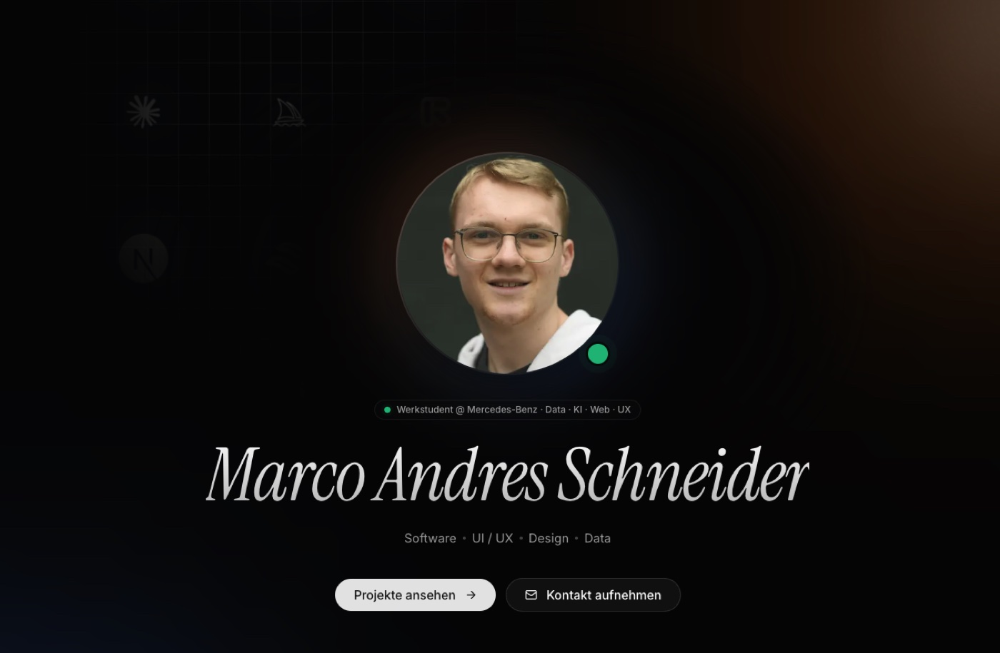

# marcoandres.dev — Portfolio



Personal portfolio site of Marco Schneider — Business Informatics student at HdM Stuttgart and Working Student in Data Management at Mercedes-Benz.

**Live:** [marcoandres.dev](https://marcoandres.dev)

## Stack

- **Framework:** Next.js 16 (App Router, Turbopack), React 19, TypeScript
- **Styling:** Tailwind CSS v4, shadcn/ui (base-ui), Framer Motion
- **i18n:** next-intl (DE / EN)
- **Hosting:** Vercel
- **Video CDN:** Cloudflare R2

## Getting Started

```bash
git clone https://github.com/dreeeez/portfolio.git
cd portfolio
npm install
cp .env.example .env.local   # then fill in NEXT_PUBLIC_VIDEO_CDN
npm run dev
```

Open [http://localhost:3000](http://localhost:3000).

## Project Structure

```
app/[locale]/        Locale-scoped routing (DE/EN)
components/sections/ Hero · About · Skills · Projects · Now · Timeline · Contact
content/             Typed data for projects, skills, timeline
messages/            Translation strings (de.json / en.json)
lib/media.ts         videoUrl helper — switches between local fallback and CDN
public/videos/       Local video fallback (gitignored — production uses R2)
```

## Environment Variables

| Name | Required | What it's for |
|---|---|---|
| `NEXT_PUBLIC_VIDEO_CDN` | Production | Public URL of the R2 bucket serving project videos |

## License

Code is for portfolio purposes — feel free to read and learn from it.
Content (images, videos, copy) is © Marco Schneider.
